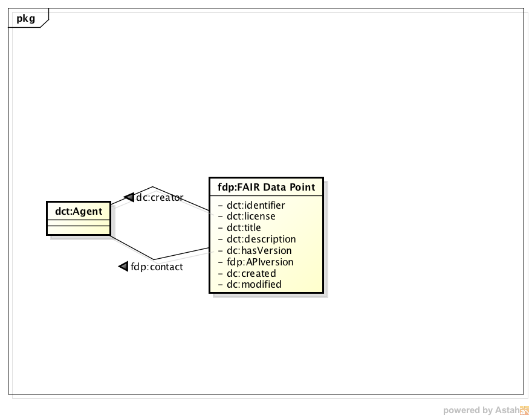

# FAIR Data Point design specification
Specification for the FAIR DataPoint. The master branch will contain the latest stable release of the specification, while the [development branch](/../../tree/development) contains the latest working draft.

For a complete specification of the FDP metadata items, see [spec.md](spec.md).

Table of contents
===
- [Introduction](#introduction)
  - [Purpose](#purpose)
  - [Product scope](#product-scope)
- [Overall Description](#overall-description)
  - [Usage Scenarios](#usage-scenarios)
    - [Data discovery](#data-discovery)
    - [Data access](#data-access)
    - [Data publication](#data-publication)
    - [Data metrics gathering](#data-metrics-gathering)
  - [Goals](#goals)
  - [Product perspective](#product-perspective)
- [Architecture](#architecture)
- [Metadata model specification](#metadata-model-specification)
- [External interfaces](#external-interfaces)
  - [Application Programming Interface (API)](#application-programming-interface-api)
    - [Metadata Provider API](#metadata-provider-api)
    - [Current implementation](#current-implementation)

# Introduction 
`FAIRDataPoint` (FDP) is a data repository that provides metadata and data in a FAIR way. FDP uses a REST API for creating, storing and serving `FAIR metadata`. FDP is a software that, from one side, allows data owners to expose datasets in a FAIR manner and, for another side, allows data users to discover information (metadata) about the offered datasets and, if license conditions allow, the actual data can be accessed.

A basic assumption for the FDP is its distributed nature. We believe that big data warehouses spanning multiple domains are not feasible and/or desirable due to issues concerning scalability, separation of concerns, data size, costs, etc. A completely decoupled and distributed infrastructure also does not seem realistic. The scenario we envision has a mixed nature, with a number of reference data repositories, containing a relevant selection of core datasets, e.g., EBI's repositories, integrated with smaller distributed data repositories, e.g., different biobanks, datasets/dababases created within the scope of research projects, etc. Many different data repositories and datasets should interoperate in order to allow increasingly complex questions to be answered. Data interoperability, however, takes place in different levels, such as syntactical and semantical. A collection of FDPs aim to address this interoperability issues by enabling data owners to share their data in FAIR manner and, therefore, fostering findability, accessibility, interoperability and reusability.

The FDP software is being initially developed as a stand-alone web application. However, the functionality/behaviour of the FDP can be also embedded in other applications to provide FAIR data accessibility to the application’s metadata and data. For instance, an existing data repository may choose to implement FDP's API and metadata content, behaving this way also as a FDP.

## Purpose

The purpose of this document is to specify the FAIR Data Point (FDP) software. This document includes requirements, architecture and design of the FDP software. This specification is primarily intended to be a reference for developing the first version of the FDP software by the DTL FAIR engineering team.

## Product Scope
FDP is a software that, from one side, allows data owners to expose datasets in a FAIR manner and, for another side, allows data users to discover properties about offered datasets (metadata) and, if license conditions allow, the actual data can be accessed.

Although an FDP may be used in any knowledge domain, we are focusing on life sciences and, therefore, for now, the examples are concerned with biological datasets.

A basic assumption for the FDP is its distributed nature. We believe that big data warehouses spanning multiple domains are not feasible and/or desirable due to issues concerning scalability, separation of concerns, data size, costs, etc. A completely decoupled and distributed infrastructure also does not seem realistic. The scenario we envision has a mixed nature, with a number of reference data repositories, containing a relevant selection of core datasets, e.g., EBI's repositories, integrated with smaller distributed data repositories, e.g., different biobanks, datasets/dababases created within the scope of research projects, etc.

Many different data repositories and datasets should interoperate in order to allow increasingly complex questions to be answered. Data interoperability, however, takes place in different levels, such as syntactical and semantical. A collection of FDPs aim to address this interoperability issues by enabling data owners to share their data in FAIR manner and, therefore, fostering findability, accessibility, interoperability and reusability.

The FDP software is being initially developed as a stand-alone web application. However, the functionality/behaviour of the FDP can be also embedded in other applications  to provide FAIR data accessibility to the application’s datasets. For instance, an existing data repository may choose to implement FDP's API and metadata content, behaving this way also as a FDP.

# Overall Description

## Usage Scenarios

From the different data interoperability projects we are involved, the following usage scenarios have been identified. We used these usage scenarios to derive the requirements for the data storage and accessibility infrastructure and guide the design and development of the solution.

### Data discovery

A researcher needs to find datasets containing data about proteins that are activated in specific tissues and combine these data with information of which genes are involved in the production of such proteins. In another situation, the researcher needs to know which biobanks carry a given type of biosample (e.g., blood samples) from patients possessing a specific phenotype (e.g., Alzheimer's disease) taken from a patient registry whose onset age was lower than 45 year-old. These data users need to use a straightforward search application that allows them to find the required information.

### Data access

Once a data user finds where the needed datasets, including the information about their licenses and access protocols, the user wants to access the data, retrieving it. Because in many situations the data user will integrate many different datasets, she/he needs that the formats in which data will be retrieved and the access methods to be standardised. In other words, the method with which the data will be accessed should be common to all datasets and data providers. Also, the data format from the datasets should be using a common representation technology that facilitates data integration.

### Data publication

A research group is running a project in which data is being created. As the data will be used during the project for analysis and may also be useful for other users, the group would like to publish them in a way that allows potential users of the data to retrieve information about the datasets (metadata), data search engines to index the datasets' metadata, and users to retrieve the data. Some of the produced datasets have an open license but others have more restrictive licenses. Therefore, the data storage and accessibility infrastructure should be able to enforce the license by imposing conditions for users to access the restricted datasets.

### Data metrics gathering

The owners of the data storage and accessibility infrastructure need to have information about the usage of their infrastructure. Different information should be gathered such as the number of users accessing the metadata and data, who are they, where are they coming from, etc. This information is used to assess the amount of computing resources necessary to cope with the requests, to assess the interest on each of the offered datasets and to understand which types of users are interested in which of the offered datasets. This information may also be used as an evidence of the relevance of the datasets, helping the data owners to justify requests for funding to keep the datasets available. The gathered metrics are to be used primarily by the owner of the FDP. The owner can opt to make the information, or part of it, publicly accessible. However, privacy concerns should be taken into account if identifiable information is gathered.

## Goals

From the usage scenarios, we have identified a need for a data storage and accessibility infrastructure that we call FAIR Data Point (FDP). The FDP has the following goals:

* Allow data owners to expose their datasets in a way that complies with the FAIR Data Principles. 
* Allow data consumers to discover information about the FAIR Data Point, its offered datasets and the actual data items from each of the datasets.
* Allow data consumers to access the data. Whenever the license of a dataset imposes further restrictions, the FDP should enforce these restrictions.
* Allow the data owner to gather access metrics about the offered (meta)data.
* Allow interaction for both humans (GUI) and software agents (API).

Based on these goals, Figure 1 depicts the general architecture of an FDP. In this architecture, the FDP exposes its functionality to the users through an application programming interface (API) and a graphical user interface (GUI). The former is intended for software clients while the later for human clients. The figure also depicts four internal components, each one responsible for one of the four main behaviours expected from an FDP, namely, (i) provisioning of metadata information, (ii) access to the offered datasets, (iii) metrics gathering of metadata and data access and usage and, (iv) access control when the dataset's license imposes restrictions.

 
     

 

 Fig. 1 - FDP General architecture based on the application's goals

## Product Perspective

The FDP has initially two usage purposes: _(i)_ to be used as a stand-alone web application, where data owners give access to their datasets in a FAIR manner and, _(ii)_ to be integrated in larger data interoperability systems, such as the FAIRport, providing the dataset accessibility functionality for such systems. Figure 2 depicts an FDP as a stand-alone application deployed in a web server, exposing to the Web its API and GUI. Figure 3 depicts a set of FDPs integrated as components in a Data FAIRport platform. In this case, each FDP gives access to the datasets published by a given data owner. Figure 4 depicts FDP's components being integrated into existing data repository solutions extending their features to include the provisioning of metadata and data in a FAIR way.

 
    

 Fig. 2 - FDP as a stand-alone Web application 

 
    

 Fig. 3 - FDP as an application component 

# Architecture

In this section we use elements from the Archimate notation. The ArchiMate modelling language is an open and independent Enterprise Architecture standard that supports the description, analysis and visualisation of architecture within and across business domains. ArchiMate is one of the open standards hosted by The Open Group and is fully aligned with TOGAF.

Figure 4 depicts a view of the current architecture of the FDP using Archimate's Application layer notation. From top down, we have the Archimate's Application Interface representing the FDP's API. This API is currently composed of two parts, the Metadata Provider API and the FAIR Data Accessor API. The Metadata Provider API is the public interface of the Metadata Provider Service. Similarly, the FAIR Data Accessor API is the public interface of the FAIR Data Accessor Service.

The Metadata Provider Service realises the Metadata Retrieval function while the FAIR Data Accessor Service realises the Data Access function. As sub-functions of the Metadata Retrieval function we have:

* FDP Metadata Retrieval: retrieves the FDP Metadata (represented by Archimate's Data Object). The FDP Metadata is composed by a number of Catalog Metadata. FDP Metadata Retrieval function lead to the Catalog Metadata Retrieval function by appending the URIs of the Catalog Metadata at the end of the FDP Metadata content.
* Catalog Metadata Retrieval: retrieves the Catalog Metadata. The Catalog Metadata is composed by a number of Dataset Metadata. The Catalog Metadata Retrieval function lead to the Dataset Metadata Retrieval function by containing the URIs of the Dataset Metadata in the Catalog Metadata content.
* Dataset Metadata Retrieval: retrieves the Dataset Metadata. The Dataset Metadata can have a number of Distribution Metadata. The Dataset Metadata Retrieval function lead to the Distribution Metadata Retrieval function by containing the URIs of the Distribution Metadata in the Dataset Metadata content. Also, The Dataset Metadata can have a Data Record Metadata. The Dataset Metadata Retrieval function can lead to the Data Record Metadata Retrieval function by appending the URI of the Data Record Metadata in the Dataset Metadata content.
* Distribution Metadata Retrieval: retrieves the Distribution Metadata. The Distribution Metadata describes information about the concrete representation of the dataset such as file format, access or download URL, size, etc.
* Data Record Metadata: retrieves the Data Record Metadata. The Data Record Metadata describes the structure and content of the dataset such as involved types, domain and range of the values, relations among the types, etc.

The FAIR Data Accessor Service realises the Data Access function. In its turn, the Data Access is subdivided in Linked Data Platform Access (LDP Access) and Linked Data Fragments Access (LDF Access). These two options of FAIR Data Access give access to the actual data in a FAIR Format. 

The details of what each of these metadata object represent are given in the Metadata section below in this document. Also, the details of the FAIR Data Point API are given below in this document at the Application Programming Interface (API) section.

Fig. 4 - FDPs’ Archimate Application layer architecture

# Metadata model specification
See [spec.md](spec.md) for the metadata model specification.

# External Interfaces

## Application Programming Interface (API)

The FDP's API follows the [REST](https://en.wikipedia.org/wiki/Representational_state_transfer) architectural style and, more specifically, the [Hypermedia as the Engine of Application State (HATEOAS)](https://en.wikipedia.org/wiki/HATEOAS) pattern. In summary, a HATEOAS API provides information on how to navigate through the API even if the client does not have previous knowledge of the interface.

### Metadata Provider API

Figure below depicts the HATEOAS RESTful API of FDP. In the figure, the upper-left box represents the FDP service and responds to requests to the root URL, hereby represented as "/". 

When the FAIR Data Point Service root URL receives an HTTP GET request (e.g., http://mydomain.com/fdp/), the Metadata Service returns the FDPMetadata resource. This resource contains information about the FDP itself such as the owner (organisation or individual), FDP version, API version, etc. The content of the FDPMetadata resource is based on the Repository concept defined in the Open Initiative Archive Protocol for Metadata Harvesting (OAI-PMH). Following the HATEOAS guidelines, the FDPMetadata resource also provides a link to the CatalogMetadata resource.

The CatalogMetadata resource provides a list of links of DatasetMetadata resources for each of the datasets offered by the FDP. This resource is equivalent to W3C's DCAT Catalog concept. An example URL: http://mydomain.com/fdp/comparativeGenomics.

The DatasetMetadata resource provides information about the each of the offered datasets. Information includes datasets owner, license, distribution, etc. This resource is equivalent to W3C's DCAT Dataset. An example URL: http://mydomain.com/fdp/comparativeGenomics/goNlSvR5 .
 
The DistributionMetadata resource provides information about the distribution of a dataset. Information includes license, downloadURL or accessURL of a dataset distribution. This resource is equivalent to W3C's DCAT Distribution. An example URL: http://mydomain.com/fdp/comparativeGenomics/goNlSvR5/turtleFile .

### Current implementation

In this GitHub repository we published our reference implementation of the FDP API based on Java. In the current implementation we only support GET requests and only FAIR MetaData are stored and served. The metadata contents should be generated manually according to the metadata description above.  Although by adopting HATEOAS guidelines an API specification is not needed because, at any point, a HATEOAS API provides information about how to navigate further from that point, it is still relevant to document the whole FDP API.

The figure below shows the swagger API documentation of the FDP API.

The default response content-type is “text/turtle”. In addition to this the API client also request content-type in “text/n3”, “application/rdf+xml” and “application/ld+json” 
